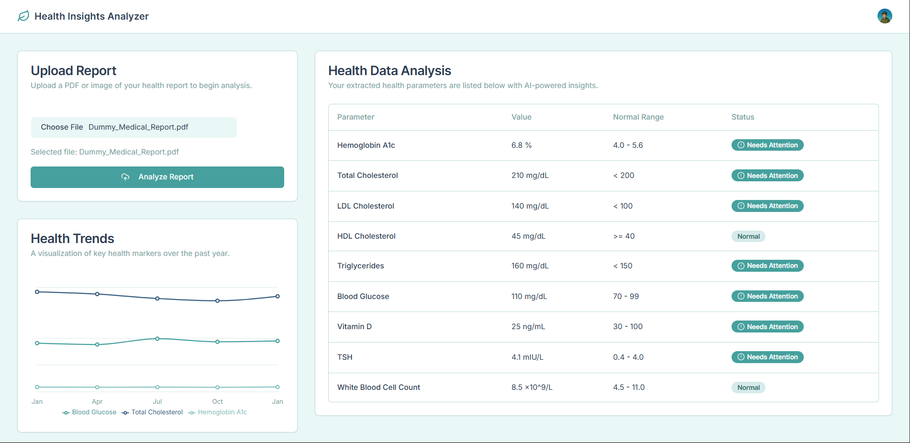

# Health Insights Analyzer

A modern web application for analyzing health reports and visualizing key health metrics. Built with Next.js and Tailwind CSS, this app allows users to upload medical reports (PDF or image), extract and analyze health parameters, and visualize trends over time.


## Features

- **Upload Health Reports:** Upload PDF or image files of your health reports for analysis.
- **AI-Powered Data Extraction:** Automatically extract key health parameters from uploaded reports.
- **Health Data Analysis:** View extracted values, normal ranges, and status indicators (e.g., "Needs Attention").
- **Trends Visualization:** Interactive charts to visualize health markers over the past year.
- **Modern UI:** Clean, responsive interface built with Tailwind CSS and React components.

## Demo

Below is a screenshot of the application in action:



## Getting Started

### Prerequisites
- Node.js (v18 or higher recommended)
- npm or yarn

### Installation

1. **Clone the repository:**
   ```bash
   git clone <your-repo-url>
   cd korai_healtcare_application
   ```
2. **Install dependencies:**
   ```bash
   npm install
   # or
   yarn install
   ```
3. **Run the development server:**
   ```bash
   npm run dev
   # or
   yarn dev
   ```
4. Open [http://localhost:3000](http://localhost:3000) in your browser.

## Project Structure

- `src/app/` — Main application pages and layouts
- `src/components/` — Reusable UI and feature components
- `src/lib/` — Utility functions and mock data
- `src/hooks/` — Custom React hooks
- `public/` — Static assets (SVGs, icons, etc.)

## Technologies Used
- [Next.js](https://nextjs.org/)
- [React](https://react.dev/)
- [Tailwind CSS](https://tailwindcss.com/)
- TypeScript

